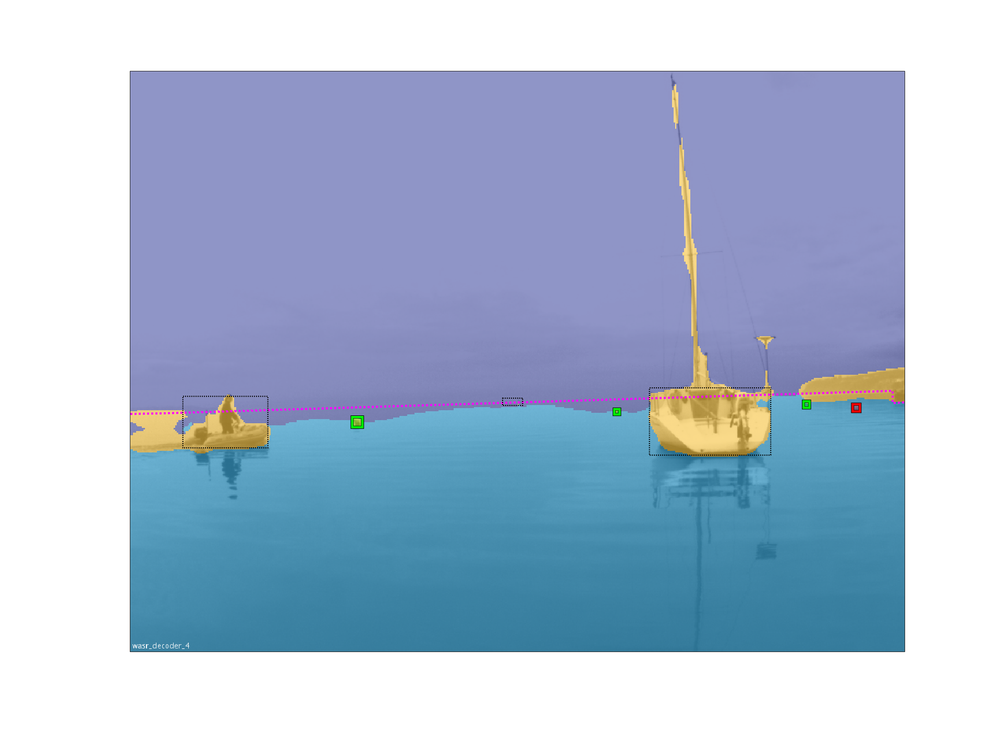
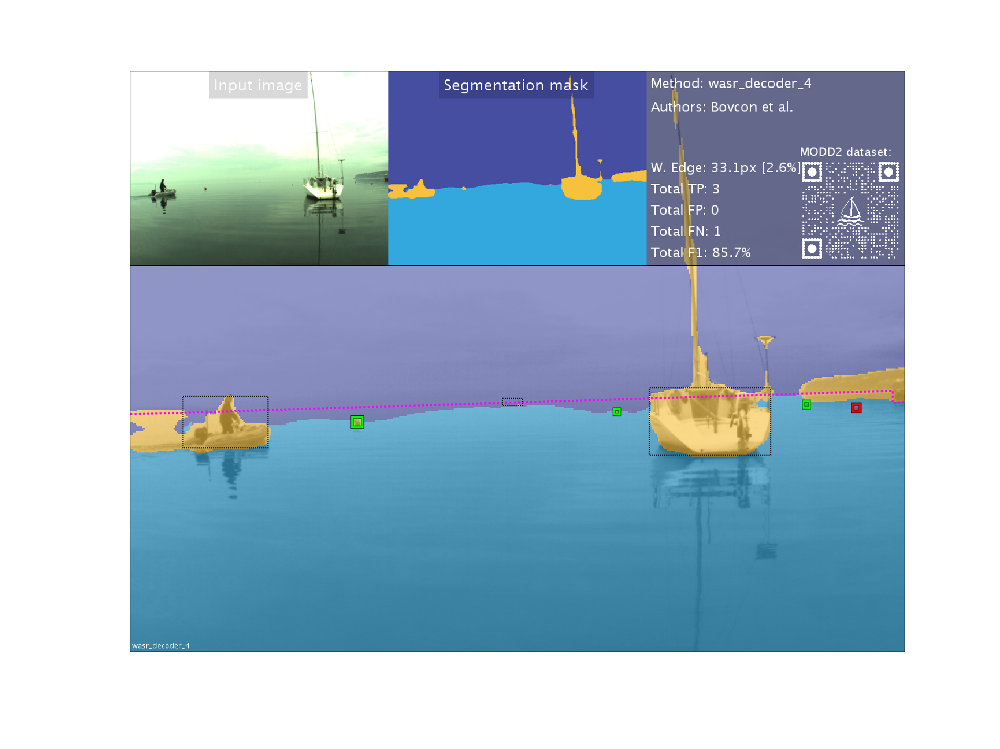
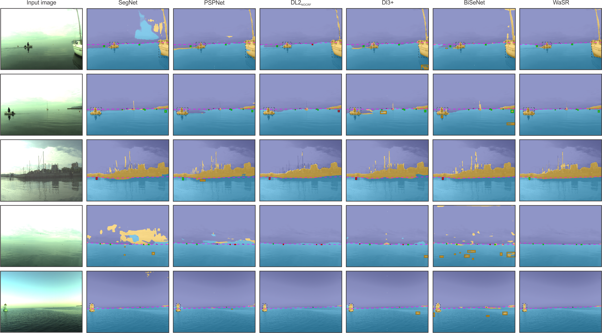

# Marine Semantic Segmentation Training Dataset (MaSTr1325) [1]
MaSTr1325 is a new large-scale marine semantic segmentation training dataset tailored for development of obstacle detection methods in small-sized coastal USVs. The dataset contains 1325 diverse images captured over a two year span with a real USV, covering a range of realistic conditions encountered in a coastal surveillance task. All images are per-pixel semantically labeled and synchronized with inertial measurements of the on-board sensors. In addition, a dataset augmentation protocol is proposed to address slight appearance differences of the images in the training set and those in deployment.

### Labeling
Each image from the dataset was manually annotated by human annotators with three categories (sea, sky and environment). An image editing software supporting multiple layers per image was used and each semantic region was annotated in a separate layer by multiple sized brushes for speed and accuracy. All annotations were carried out by in-house annotators and were verified and corrected by an expert to ensure a high-grade per-pixel annotation quality. The annotation procedure and the quality control took approximately twenty minutes per image. To account for the annotation uncertainty at the edge of semantically different regions, the edges between these regions were labeled by the unknown category. This label ensures that these pixels are excluded from learning.

Labels in ground-truth annotation masks correspond to the following values:
<ul>
	<li>
		Obstacles and environment = 0 (value zero)
	</li>
	<li>
		Water = 1 (value one)
	</li>
	<li>
		Sky = 2 (value two)
	</li>
	<li>
		Ignore region / unknown category = 4 (value four)
	</li>
</ul>

### Augmentation
In practice, we can realisticlly expect that the camera exposure and other parameters at application time differ from those used in the dataset acquisition. Data augmentation helps us effectively induce a regularization effect in the learning process. We thus propose applying the following data augmentations:
<ol>
	<li>vertical mirroring,</li>
	<li>central rotations of +/- [5, 15] degrees,</li>
	<li>elastic deformation of the water component,</li>
	<li>color transfer.</li>
</ol>

### Download

The dataset is publicly available for download:<br>
&darr; <a href="http://box.vicos.si/borja/mastr1325_dataset/MaSTr1325_images_512x384.zip">MaSTr1325 Images [512x384]</a><br>
&darr; <a href="http://box.vicos.si/borja/mastr1325_dataset/MaSTr1325_masks_512x384.zip">MaSTr1325 Ground Truth Annotations [512x384]</a><br>
&darr; <a href="#">MaSTr1325 Images [1278x958]</a> (soon)<br>
&darr; <a href="#">MaSTr1325 Ground Truth Annotations [1278x958]</a> (soon)

# Multi-modal Obstacle Detection Dataset 2 (MODD 2) [2]
MODD2 is currently the biggest and the most challenging multi-modal marine obstacle detection dataset captured by a real USV. Diverse weather conditions (sunny, overcast, foggy), extreme situations (abrupt change of motion, sun gliter and reflections) and various small obstacles all contribute to its difficulty.

### Labeling
Each frame in the dataset was manually annotated by a human annotator and later verified by an expert. The edge of water is annotated by a polygon, while obstacles are outlined with bounding boxes. The annotated obstacles are further divided into two classes:
<ul>
	<li>large obstacles (whose bounding box straddles the sea edge),</li>
	<li>small obstacles (whose bounding box is fully located below the sea edge polygon).</li>
</ul>

### Download

The dataset is publicly available for download at:<br>
				&darr; <a href="http://box.vicos.si/borja/modd2_dataset/MODD2_video_data.zip">MODD2 Video Data and IMU Measurements</a><br>
				&darr; <a href="http://box.vicos.si/borja/modd2_dataset/MODD2_calibration_sequences.zip">MODD2 Calibration Sequences</a><br>
				&darr; <a href="http://box.vicos.si/borja/modd2_dataset/MODD2_annotations_v2.zip">MODD2 Ground Truth Annotations (for RAW images)</a><br>
				&darr; <a href="http://box.vicos.si/borja/modd2_dataset/MODD2_annotations_v2_rectified.zip">MODD2 Ground Truth Annotations (for rectified and undistorted images)</a><br>
				&darr; <a href="http://box.vicos.si/borja/modd2_dataset/MODD2_USVparts_masks.zip">MODD2 Masks of Visible Parts of the USV</a><br>
				
# Evaluation Scripts for Obstacle Detection in a Marine Environment

We use performance measures inspired by Kristan et al. [3]. The accuracy of the sea-edge estimation is measured by mean-squared error and standard deviation over all sequences (denoted as &mu;<sub>edg</sub> and &sigma;<sub>edg</sub> respectively). The accuracy of obstacle detection is measured by number of true positives (TP), false positives (FP), false negatives (FN), and by F-measure.
```
F_measure = (2 * TP) / (2 * TP + FP + FN)
```

To evaluate RMSE in water edge position, ground truth annotations were used in the following way. A polygon,  denoting the water surface was generated from water edge annotations. Areas, where large obstacles intersect the polygon, were removed. This way, a refined water edge was generated. For each pixel column in the full-sized image, a distance between water edge, as given by the ground truth and as determined by the algorithm, is calculated. These values are summarized into a single value by averaging across all columns, frames and sequences.

The evaluation of object detection follows the recommendations from PASCAL VOC challenges by Everingham et al. [4], with small, application-specific modification: detections above the annotated water edge are ignored and do not contribute towards the FP count as they do not affect the navigation of the USV. In certain situations a detection may oscillate between fully water-enclosed obstacle and the <i>dent</i> in the shoreline. In both cases, the obstacle is correctly segmented as non-water region and it can be successfully avoided. However, in first scenario the obstacle is explicitly detected, while second scenario provides us with only indirect detection. To address possible inaccuracies causing dents in the water-edge, the overlap between the dented region and obstacle is defined more strictly as that of water-enclosed obstacles. Note that the proposed treatment of detections is consistent with the problem of obstacle avoidance.

There are two evaluation scripts available:
<ul>
	<li>
		<i>modd2_evaluate_all_sequences_raw</i> - for evaluating the performance on raw and distorted images,
	</li>
	<li>
		<i>modd2_evaluate_all_sequences_undist</i> - for evaluating the performance on undistorted and rectified images.
	</li>
</ul>

Both evaluation scripts expect the same input parameters: a path to the MODD2 dataset root folder, a path to the folder where segmentation results are stored, a method name and a matrix of segmentation colors representing three labels (sky, obstacles and water). The folder containing segmentation results should be structured in the following way (an example for a method <i>wasr_decoder_2</i>):
```
├───seq01
│   └───wasr_decoder_2
├───seq02
│   └───wasr_decoder_2
├───seq03
│   └───wasr_decoder_2
...
└───seq28
    └───wasr_decoder_2
```
The segmentation process should classify each pixel of an image in one of the three semantic categories:
<ol>
	<li>
		Sky
	</li>
	<li>
		Obstacles / Environment
	</li>
	<li>
		Water
	</li>
</ol>

Each semantic category is represented with its own color in a segmentation mask. For evaluation purposes we need to provide a 3x3 matrix of RGB values, where the first row of the matrix corresponds to the RGB encoding of the sky component, the second row corresponds to the RGB encoding of the obstacles/environment component and the third row corresponds to the RGB encoding of the water component.

```
segmentation_colors = [R_sky, G_sky, B_sky; ...
                       R_obs, G_obs, B_obs; ...
		       R_wtr, G_wtr, B_wtr];
```

A code example for running performance evaluation script on raw and distorted images for method <i>wasr_decoder_2</i>:
```
modd2_evaluate_all_sequences_raw('Projects/Viamaro/dataset_public', ...
				 'Projects/WASR_results', ...
				 'wasr_decoder_2', ...
				 [69, 78, 161; ...
				  246, 193, 59; ...
				  51, 168, 222]);
```
A code example for running performance evaluation script on rectified and undistorted images for method <i>wasr_decoder_2</i>:
```
modd2_evaluate_all_sequences_rectified('Projects/Viamaro/dataset_public', ...
				       'Projects/WASR_results', ...
				       'wasr_decoder_2', ...
				       [69, 78, 161; ...
				        246, 193, 59; ...
				        51, 168, 222]);
```
Two folders are created during the evaluation process - <i>postprocessing</i> and <i>results</i>.
For each sequence in the dataset a new <i>.mat</i> file inside the <i>postprocessing</i> folder is created, holding the information of the postprocessed binary water mask for each frame and a list of total detections present in each frame. Similarly, a new <i>.mat</i> file inside the <i>results</i> folder is generated for each sequence in the dataset. This file contains RMSE of water-edge and the number of TP, FP and FN detections for each frame of the sequence. It also contains the information of possible special occurances during the sequence (prominent sun glitter, sudden change of motion or environmental reflections present on the water surface).

An example console output of the evaluation script for rectified sequences using <i>test_method</i> would look like:
```
**********************************
* Evaluation on RECTIFIED images *
* Method:            test_method *
**********************************
* Total RMSE:            10.8 px *
* Total STD:             16.6 px *
* Total STE:             00.2 px *
* Total TP:                 5082 *
* Total FP:                01458 *
* Total FN:                 0367 *
* F-measure:              84.8 % *
**********************************
```

An extensive evaluation of state-of-the-art segmentation methods is available on our website <a href="http://box.vicos.si/borja/viamaro/index.html#leaderboard">MODD 2 LeaderBoard</a>.

# Visualization Scripts
To keep visualizations of the results consistent with our paper, we propose using our Matlab visualization scripts. There are two functions available for visualization:
<ul>
	<li> <i>modd2_visualize_frame</i> --- for visualizing a single frame </li>
	<li> <i>modd2_generate_video</i> --- for generating a video of the chosen sequence</li>
</ul>

The <i>modd2_visualize_frame</i> expects eight required input parameters (dataset path, path to segmentation masks, method name, author name, sequence number, frame number, use rectified images (boolean), type of visualization (0 - for qualitative comparison, 1 - for video). Generating a single frame visualization for qualitative comparison can be done by executing the following command:
```
modd2_visualize_frame('Projects/Viamaro/dataset_public', ...
                      'Projects/WASR_results', ...
		      'wasr_decoder_4', ...
		      'Bovcon et al.', ...
		      7, 350, 0, 0);
```
which outputs us the following image:
<br>

Generating a single frame visualization for a video can be done by executing the following command:
```
modd2_visualize_frame('Projects/Viamaro/dataset_public', ...
                      'Projects/WASR_results', ...
		      'wasr_decoder_4', ...
		      'Bovcon et al.', ...
		      7, 350, 0, 1);
```
which outputs us the following image:


To generate a video visualization we use <i>modd2_generate_video</i> function. It expects six required input parameters (dataset path, path to segmentation masks, method name, author name, sequence number, use rectified images (boolen)). An example call of this function for non-rectified raw images is:
```
modd2_generate_video('Projects/Viamaro/dataset_public', ...
                      'Projects/WASR_results', ...
		      'wasr_decoder_4', ...
		      'Bovcon et al.', ...
		      7, 0);
```
## Qualitative comparison


## Cite this paper
You are kindly asked to cite our corresponding papers if you use provided datasets and/or evaluation scripts:

```
@inproceedings{bb_iros_2019,
  title={The MaSTr1325 dataset for training deep USV obstacle detection models},
  author={Bovcon, Borja and Muhovi{\v{c}}, Jon and Per{\v{s}}, Janez and Kristan, Matej},
  booktitle={2019 IEEE/RSJ International Conference on Intelligent Robots and Systems (IROS)},
  year={2019},
  pages={3431--3438},
  organization={IEEE}
}
```

```
@article{bb_ras_2018,
  title={Stereo obstacle detection for unmanned surface vehicles by {IMU}-assisted semantic segmentation},
  author={Bovcon, Borja and Muhovi{\v{c}}, Jon and Per{\v{s}}, Janez and Kristan, Matej},
  journal={Robotics and Autonomous Systems},
  volume={104},
  pages={1--13},
  year={2018},
  publisher={Elsevier}
}
```

## References
[1] <a href="">Bovcon, Borja, et al. "The MaSTr1325 dataset for training deep USV obstacle detection models"<br>
	IEEE/RSJ International Conference on Intelligent Robots and Systems (2019): 3431-3438.</a><br>
[2] <a href="https://www.sciencedirect.com/science/article/pii/S0921889017305808">Bovcon, Borja, et al."Stereo obstacle detection for unmanned surface vehicles by {IMU}-assisted semantic segmentation"<br>
	Robotics and Autonomous Systems 104 (2018): 1-13.</a><br>
[3] <a href="https://ieeexplore.ieee.org/abstract/document/7073635">Kristan, Matej, et al. "Fast Image-Based Obstacle Detection from Unmanned Surface Vehicles."<br>
	IEEE Transactions on cybernetics 46.3 (2015): 641-654.</a><br>
[4] <a href="https://link.springer.com/article/10.1007/s11263-009-0275-4">Everingham, Mark, et al. "The Pascal Visual Object Classes (VOC) Challenge."<br>
	International Journal of Computer Vision 88.2 (2010): 303-338.</a>
